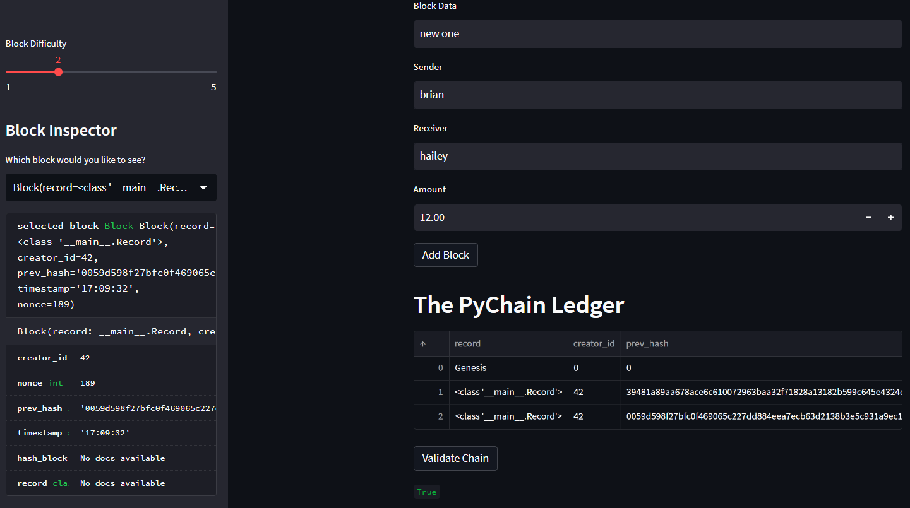

# PyChain-Ledger
____
#### As a fintech engineer working at one of the world's largest banks, I have been tasked with leading the development of a decentralized finance team. My objective is to build a blockchain-based ledger system with a user-friendly web interface. This ledger will enable partner banks to conduct financial transactions and ensure the integrity of the data stored.
---
#### To achieve this, I will make the following updates to the provided Python file:

1. I will create a new data class called Record, which will serve as the blueprint for storing financial transaction records within the ledger's blocks.

2. I will modify the existing Block data class to incorporate the Record data, ensuring that each block can store the relevant transaction information.

3. I will enhance the Streamlit interface by adding appropriate user inputs, allowing for a seamless interaction with the ledger system.

Finally, I will conduct tests by storing records in the PyChain ledger, ensuring that the system functions as intended and meets the requirements of our decentralized finance team.

